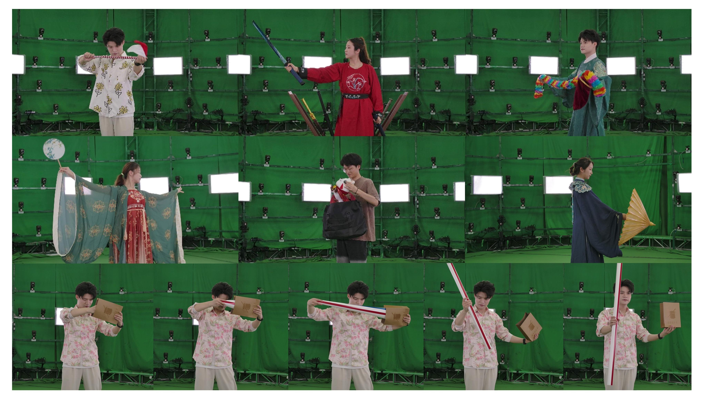

# TaoGS Dataset
The dataset of the paper "Topology-Aware Optimization of Gaussian Primitives for Human-Centric Volumetric Videos".

## Topology-Aware Optimization of Gaussian Primitives for Human-Centric Volumetric Videos

**[Yuheng Jiang](https://nowheretrix.github.io/), [Chengcheng Guo](https://github.com/gcccccccccccc12345), [Yize Wu](https://github.com/wuyize25), [Yu Hong](https://github.com/xyi1023), [Shengkun Zhu](https://github.com/zsk0219), [Zhehao Shen](https://github.com/moqiyinlun), [Yingliang Zhang](https://cn.linkedin.com/in/yingliangzhang), [Shaohui Jiao](https://cn.linkedin.com/in/shaohui-jiao-3b563826), [Zhuo Su](https://suzhuo.github.io/), [Lan Xu](http://xu-lan.com/), [Marc Habermann](https://people.mpi-inf.mpg.de/~mhaberma/), [Christian Theobalt](https://people.mpi-inf.mpg.de/~theobalt/).** 

*SIGGRAPH Asia 2025*

[[Project Page]](https://guochch.github.io/TaoGS/) [[Paper Link]](https://arxiv.org/abs/2509.07653) [[Dataset Link]](https://cvrmkura-my.sharepoint.com/:f:/g/personal/sdjnes_cvrmkura_onmicrosoft_com/EkLQzzmfMM5EhWfKBUzPjrwB1Q98SlBha4gRV7lHLUcU-Q?e=dPiBQ1)



### Description

We have currently uploaded 7 sample cases of data with different people and diverse motions. 

### Setup
To extract videos from the dataset into a standard data format, first clone [BackgroundMattingV2](https://github.com/PeterL1n/BackgroundMattingV2) and download the pre-trained model [pytorch_resnet50.pth](https://github.com/PeterL1n/BackgroundMattingV2/releases/download/v1.0.0/pytorch_resnet50.pth). Then, put pytorch_resnet50.pth to `BackgroundMattingV2/ckpt`.

```
git clone https://github.com/PeterL1n/BackgroundMattingV2
pip install torch==2.1.2 torchvision==0.16.2 torchaudio==2.1.2 --index-url https://download.pytorch.org/whl/cu118
pip install -r requirements.txt
```
Use `process.sh` to extract frames, perform matting, and apply undistortion to the data:
```
bash process.sh
```

The overall file structure after processing is as follows:
```
├── image_white
│    ├── %d                - The frame number, starts from 0.
│    │   └──%d.png         - Masked RGB images for each view. view number starts from 0.
│    └── transforms.json   - Camera extrinsics and intrinsics in NGP format.
│
├── image_white_undistortion
│    ├── %d                - The frame number, starts from 0.
│    │   └──%d.png         - Undistorted maksed RGB images for each view. view number starts from 0.
│    └── colmap/sparse/0   - Camera extrinsics and intrinsics in Gaussian Splatting format.
```

To run algorithms on **single-frame** data, you need to move the calibration files. For `image_white` under [instant-ngp](https://github.com/NVlabs/instant-ngp) format, rename the frame folder to `images` and move `transforms.json` to the same directory as `images`. For `image_white_undistortion` in colmap format, rename the frame folder to `images` and move the `sparse/0` in `image_white_undistortion/colmap` folder to the same directory as `images`.

### Download our dataset
The dataset is publicly accessible at [Link](https://cvrmkura-my.sharepoint.com/:f:/g/personal/sdjnes_cvrmkura_onmicrosoft_com/EkLQzzmfMM5EhWfKBUzPjrwB1Q98SlBha4gRV7lHLUcU-Q?e=dPiBQ1). It is authorized for **non-commercial** use only. For commercial use, please contact Yuheng Jiang (jiangyh2@shanghaitech.edu.cn) and cc Lan Xu(xulan1@shanghaitech.edu.cn) to obtain necessary permissions.

## Citation
If you find this work useful for your research, please cite us using the following BibTeX entry.
```
@misc{jiang2025topology,
    title={Topology-Aware Optimization of Gaussian Primitives for Human-Centric Volumetric Videos}, 
    author={Yuheng Jiang and Chengcheng Guo and Yize Wu and Yu Hong and Shengkun Zhu and Zhehao Shen and Yingliang Zhang and Shaohui Jiao and Zhuo Su and Lan Xu and Marc Habermann and Christian Theobalt},
    year={2025},
    eprint={2509.07653},
    archivePrefix={arXiv},
    primaryClass={cs.GR},
    url={https://arxiv.org/abs/2509.07653}, 
}
```
